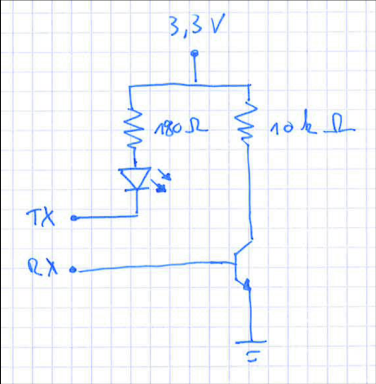

# Vito & ESP8266

## Referenzen

[https://github.com/openv/openv/wiki/Bauanleitung-NodeMCU-WIFI---MQTT---HomeAssistant](https://github.com/openv/openv/wiki/Bauanleitung-NodeMCU-WIFI---MQTT---HomeAssistant)

## Schaltplan

## Installation

- [Arduino ide](https://www.arduino.cc/en/Main/Software)
  - [ESP8266-library](https://arduino-esp8266.readthedocs.io/en/2.5.0/)
  - [VitoWifi-Github](https://github.com/bertmelis/VitoWiFi)
  - [ESPAsyncTCP](https://github.com/me-no-dev/ESPAsyncTCP)
  - [Async-Mqtt-Client](https://github.com/marvinroger/async-mqtt-client)
- [Sketch base example](https://github.com/Schnup89/OpenV_NodeMCU/blob/master/VitoWifi_NodeMCU.ino)
- [My Sketch](vito.ino)
